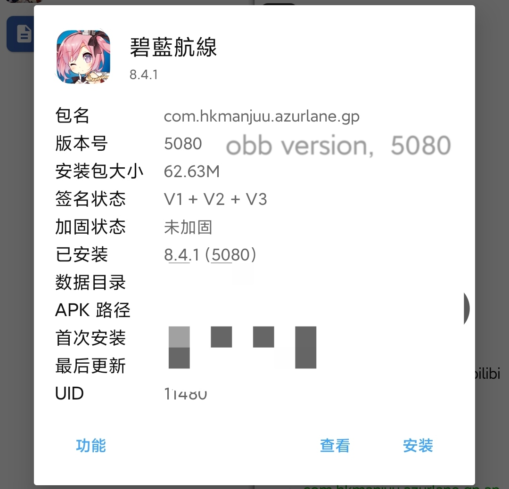
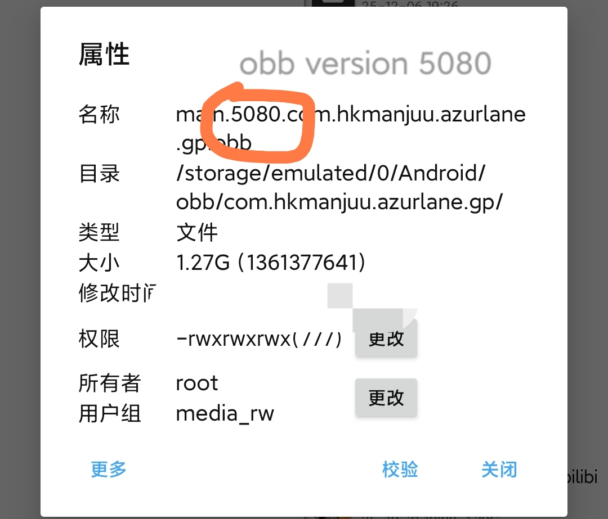
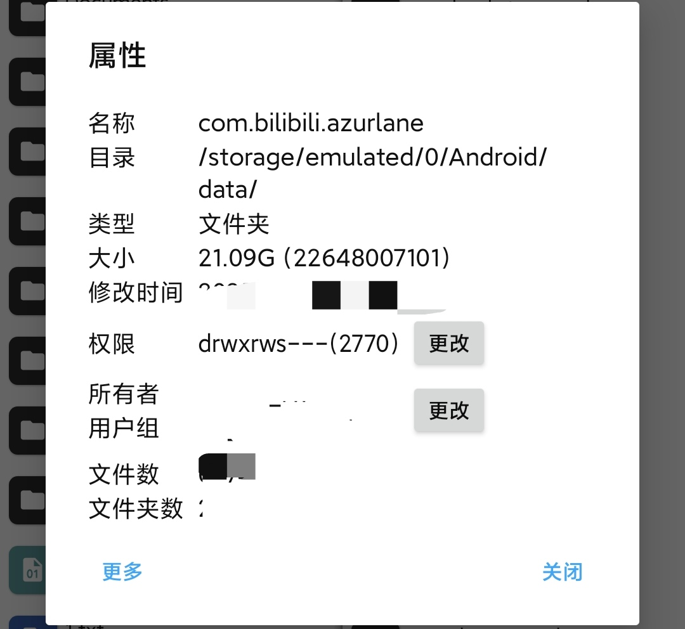

##  针对一些常见问题，尝试给出一些回答 
* [务必更新至最新版，然后确认问题是否依旧存在](https://github.com/JMBQ/azurlane/releases)
* 我使用你的打包方案制作新的APK，安装运行后无法出现悬浮窗
	* 前往“成品分享”议题寻求对应的修改apk
 	* 使用AL MOD MAKER自行打包新版本
	* 在首次运行游戏时，如果游戏没有悬浮权限，会自动打开一个设置窗口，你需要同意碧蓝航线的悬浮权限
	* 如果没有自动打开，你需要想尽一切办法来手动授权，打开悬浮权限
 	* 在一些模拟器上，悬浮窗可能无法正常显示，可能需要你关闭一些模拟器选项，比如 保后台 之类的

     
https://github.com/user-attachments/assets/c6169108-c6db-4233-a17d-d925bad2da2c

* 一直卡在更新界面，无法进入游戏
	* 如果是外服碧蓝航线，有可能是能OBB文件版本与APK版本不匹配，使用MT管理器查看apk信息和OBB信息，前往apkpure等下载站下载游戏xapk文件，解压可得OBB，将对应版本的OBB文件放到对应OBB文件夹内 
	 
    * 可以尝试清空游戏所有数据
* 安装新版本apk如果报错，一定要先卸载之前的版本后才能安装新版本吗
	* 可以先尝试直接安装，也就是覆盖安装
 	* 如果覆盖安装失败，你基本需要先卸载，再安装新版本APK
  	* 如果覆盖安装失败，你依旧不愿意卸载之前的版本，可以尝试root黑科技直接覆盖，具体操作可以去询问AI或者google  

* 卸载游戏时，如何保留之前下载的游戏资源数据
  	* 
	* 这就是数据下载位置，自己根据游戏包名来找，把该文件夹重命名为其他，安装完新版本APK后再把该文件夹名称改回来
 	* 通过上述方法绕过重新下载数据后，小概率会出现bug，参考#91
 	* 未解锁BL的手机可以使用MT管理器，依旧可以重命名该文件夹  
* 每次开启游戏都要进行一次功能选择，能不能自动保存之前的选择
  * 开启`保存配置`  
* 能不能像其他mod那样增加XXXXX功能
  * mod是基于lua c api来制作的，如果你能提供对应的源码，那就能添加

