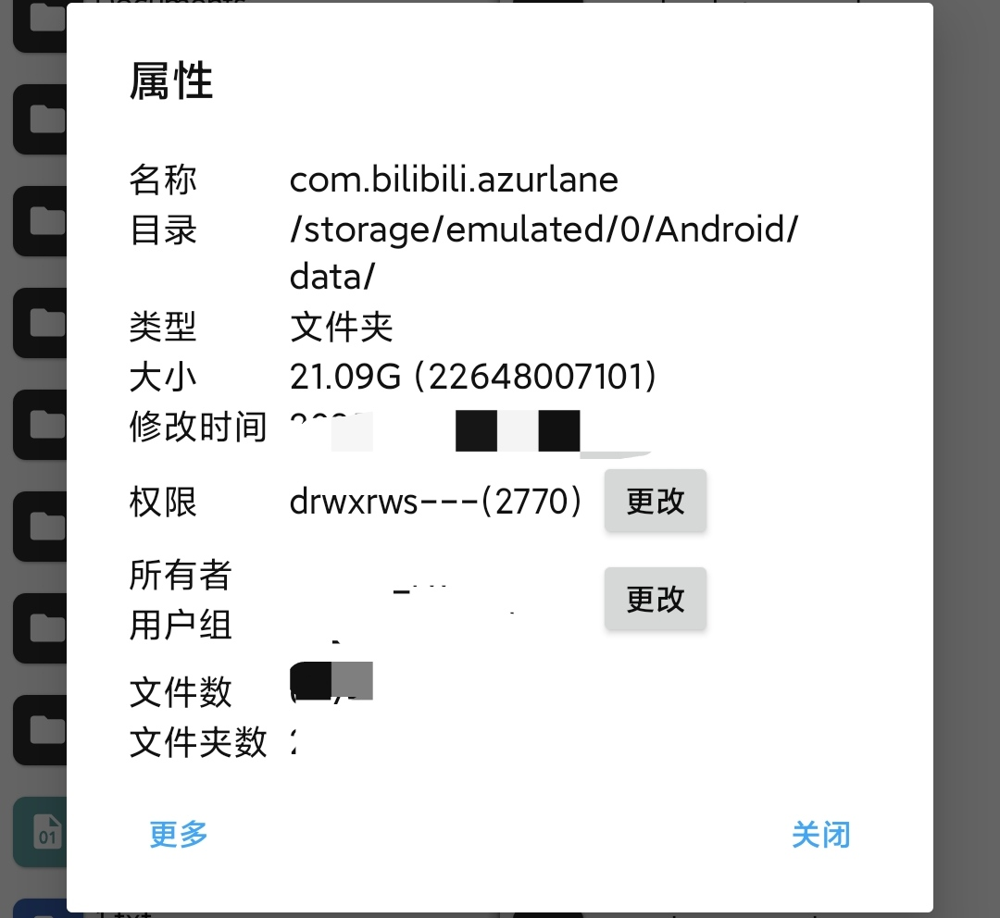

# 我觉得我必须使用简单直接的语言来解答，不然小白们是看不懂滴
* [务必更新至最新版，然后确认问题是否依旧存在](https://github.com/JMBQ/azurlane/releases)
* [务必更新至最新版，然后确认问题是否依旧存在](https://github.com/JMBQ/azurlane/releases)
* [务必更新至最新版，然后确认问题是否依旧存在](https://github.com/JMBQ/azurlane/releases)
* 我根据你给的打包方案制作新的APK，安装运行后无法出现悬浮窗
 	* 最简单的解决方式，不要自己打包，使用别人打包的apk
  		* 模拟器：直接卸载模拟器，然后重新下载安装模拟器，还不行就更换其他模拟器
    	* 手机：这个最简单，换手机就行了
	* 前往“成品分享”议题寻求对应的修改apk
 	* 使用AL MOD MAKER自行打包新版本

     
https://github.com/user-attachments/assets/c6169108-c6db-4233-a17d-d925bad2da2c

* 一直卡在更新界面，无法进入游戏
	* 如果是外服碧蓝航线，有可能是能OBB文件版本与APK版本不匹配，点开悬浮窗->`更新`，可直接查看OBB版本是否正确
		* 前往apkpure等下载站下载游戏xapk文件，解压可得OBB，将对应版本的OBB文件放到对应OBB文件夹内 
    * 可以尝试清空游戏所有数据
      
* 如何从xpak中获取obb文件

https://github.com/user-attachments/assets/cbf06ce6-4dc8-4dae-80ac-d96e185ded61

* 安装新版本apk如果报错，一定要先卸载之前的版本后才能安装新版本吗
	* 可以先尝试直接安装，也就是覆盖安装
 	* 如果覆盖安装失败，你基本需要先卸载，再安装新版本APK
  	* 如果覆盖安装失败，你依旧不愿意卸载之前的版本，可以尝试root黑科技直接覆盖，具体操作可以去询问AI或者google  

* 卸载游戏时，如何保留之前下载的游戏资源数据
  	* 
	* 这就是数据下载位置，自己根据游戏包名来找，把该文件夹重命名为其他，安装完新版本APK后再把该文件夹名称改回来
 	* 通过上述方法绕过重新下载数据后，小概率会出现bug，参考[#91](https://github.com/JMBQ/azurlane/issues/91)
 	* 未解锁BL的手机可以使用MT管理器，依旧可以重命名该文件夹  
* 每次开启游戏都要进行一次功能选择，能不能自动保存之前的选择
  * 悬浮窗`设置`->`保存配置`开启  
* 能不能像其他mod那样增加XXXXX功能
  * mod是基于lua c api来制作的，如果你能提供对应的源码，那就有可能能添加
  * 根据功能存在的意义来决定，既不能节省时间又不能优化游戏体验的功能不允许存在

