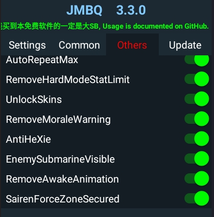

[切换中文](README_CN.md)

# Azur Lane MOD MENU
* Created based on [Perseus](https://github.com/Egoistically/Perseus) and [4pii4/PiePerseus](https://github.com/4pii4/PiePerseus)
* I've refactored the code logic to fix the crashing issue
# Feature
* `Multiple attack ratio`、`Multiple defence ratio`
  * `Multiple defence ratio`: Does not work in `exercise`
* `Ship reload ratio`: The higher the ratio, the faster the reload
* `fastStageMovement`、`worldFastStageMovement`
  * `worldFastStageMovement`: `Sairen` map
* `RemoveBBAnimation`: Remove ship cannon firing animation
* `RemoveBattleUBCGPicture`: Does this really need an explanation?
* `AutoRepeatMax`
* `RemoveHardModeStatLimit`：Remove restrictions on ship types and numerical values
* `RemoveMoraleWarning`
* `Skins`：unlock all skins, Including share skins and dorm skins
* `antiHeXie`：Implemented by hooking internal methods，Involving ship names, ship skins, and Propose
* `EnemySubmarineVisible`
* `RemoveAwakeAnimation`
* `SairenForceZoneSecured`
# Download
* We provide only the production method, not the finished product
* If you don't know how to create a finished APK, you can come [HERE](https://github.com/JMBQ/azurlane/issues/34) to find download links
* Use [AL MOD MAKER](https://github.com/JMBQ/azurlane/tree/main/AL_Mod_Maker)
# Usage
 
* `Settings`: recommend enabling `Save feature preferences`
* supporting floating icon position memory and floating icon size adjustment.
* If you can't see the floating icon，[Click here](Question_CN.md)

# Question
* [Click here](Question_CN.md)

# Credits
* [Egoistically/Perseus](https://github.com/Egoistically/Perseus)
* [4pii4/PiePerseus](https://github.com/4pii4/PiePerseus)
