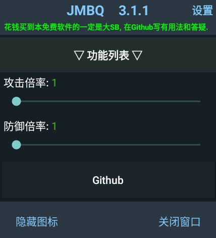

# 碧蓝航线 MOD MENU
* 基于[Perseus](https://github.com/Egoistically/Perseus) 和 [4pii4/PiePerseus](https://github.com/4pii4/PiePerseus)源代码创建，优化了代码逻辑并修复了闪退
* 从未授权任何人售卖本软件，不要相信奸商的任何话术(换成是我，直接申请退款，理由就写商家在商品里骂人)
* 如果奸商有本事能抹掉我骂SB的文字，那等同于我自动授权了

# 功能

- [x] 倍攻倍防
- [x] 舰船装填倍率，倍率越高，装填越快
- [x] 普通移动加速，大世界移动加速
- [x] 移除舰炮开火动画
- [x] 突破连续作战上限
- [x] 移除困难限制：解除舰船类型限制和数值限制
- [x] 移除低心情警告
- [x] 解锁全皮：包括共享皮肤和宿舍皮肤
- [x] 反和谐：通过hook内在方法来实现，涉及舰船名称、舰船皮肤、誓约(这都被和谐过了?)
- [x] 拦截部分作弊数据
# 下载
* 只提供制作方法，不提供成品
* 如果你不会制作成品apk，可以来[这里](https://github.com/JMBQ/azurlane/issues/34)寻找下载链接
* 你也可以使用AL MOD MAKER来自行制作，关于它的用法不想说太多，只能说不会用就纯属智力问题了
# 用法

* 右上角的`设置`可切换至设置页面，建议开启`保存设置`，可以自动保存你的功能设置和数值
* 支持记忆悬浮图标的位置 和 修改悬浮图标大小
* 如果你看不到悬浮图标，那就想尽一切办法把游戏的悬浮权限打开，手动授权
* 在一些模拟器上，悬浮窗可能无法正常显示，可能需要你关闭一些模拟器选项，比如 保后台 之类的

# 常见问题
* [点击这里](Question_CN.md)

# 源码贡献
* [Egoistically/Perseus](https://github.com/Egoistically/Perseus)
* [4pii4/PiePerseus](https://github.com/4pii4/PiePerseus)
