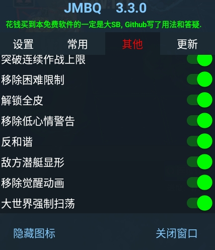

# 碧蓝航线 MOD MENU
* 基于[Perseus](https://github.com/Egoistically/Perseus) 和 [4pii4/PiePerseus](https://github.com/4pii4/PiePerseus)源代码创建，优化了代码逻辑并修复了闪退
* 从未授权任何人售卖本软件，不要相信奸商的任何话术(换成是我，直接申请退款，理由就写商家在商品里骂人)
* 如果奸商有本事能抹掉我骂SB的文字，那等同于我自动授权了

# 功能
* 倍攻倍防
  * 倍防全图生效，倍攻仅在`演习`不生效
* 舰船装填倍率：倍率越高，装填越快
* 普通移动加速，大世界移动加速
* 移除舰炮开火动画
* 移除战斗全屏CG图：见名知意
* 突破连续作战上限
* 移除困难限制：解除舰船类型限制和数值限制
* 移除低心情警告
* 解锁全皮：包括共享皮肤和宿舍皮肤
* 反和谐：通过hook内在方法来实现，涉及舰船名称、舰船皮肤、誓约(这都被和谐过了?)
* 敌方潜艇显形
* 移除觉醒动画：为了节省时间
* 大世界强制扫荡：去除`当前并未处于安全区域内`限制
# 下载
* 只提供制作方法，不提供成品
* 如果你不会制作成品apk，可以来[这里](https://github.com/JMBQ/azurlane/issues/34)寻找下载链接
* 你也可以使用[AL MOD MAKER](https://github.com/JMBQ/azurlane/tree/main/AL_Mod_Maker)一键打包出菜单apk，关于它的用法不想说太多，只能说不会用就纯属智商问题了
# 封禁指南
* 可能会导致你被封号，2天后被封或者20年后被封
* 用别怕，怕别用，卸载保账号吧
* 又怂又想用，那就只开个全皮
* 外国佬从来没跑来这问过封禁的事，他们心里都有B数
* 每个区服的封禁策略可能不同，但目前B服很宽容，懂没
# 用法
 
* `设置`：建议开启`保存配置`，可以自动保存你的功能设置和数值
* 支持记忆悬浮图标的位置 和 修改悬浮图标大小 (3.3更改代码，防止小白太笨不会改)
* 如果你看不到悬浮图标，[点击这里](Question_CN.md)

# 常见问题
* [点击这里](Question_CN.md)

# 源码贡献
* [Egoistically/Perseus](https://github.com/Egoistically/Perseus)
* [4pii4/PiePerseus](https://github.com/4pii4/PiePerseus)
